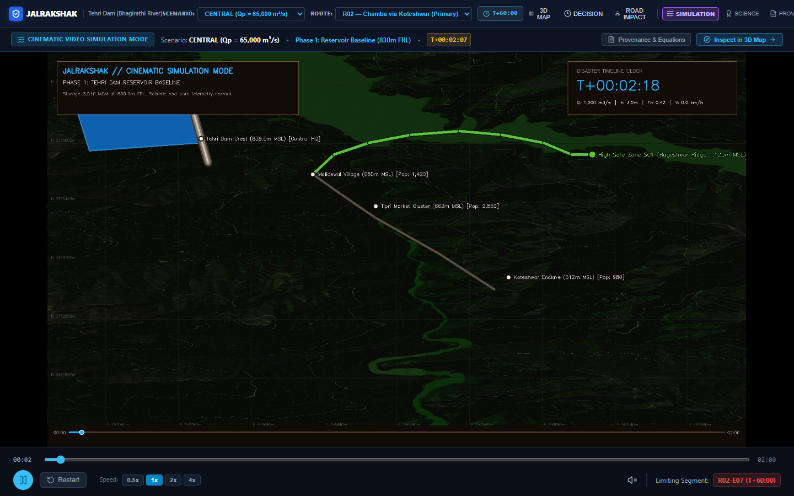
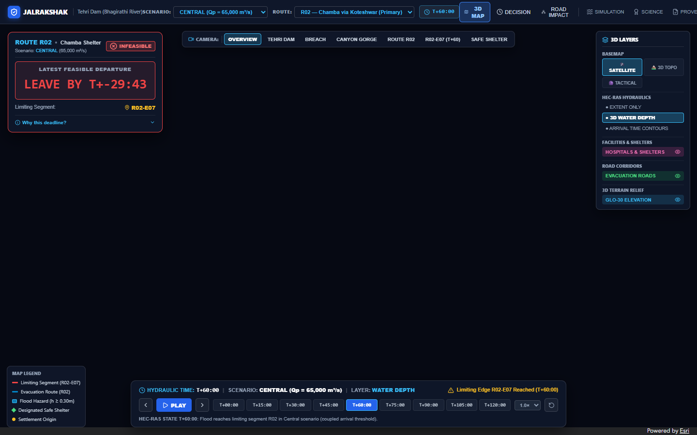
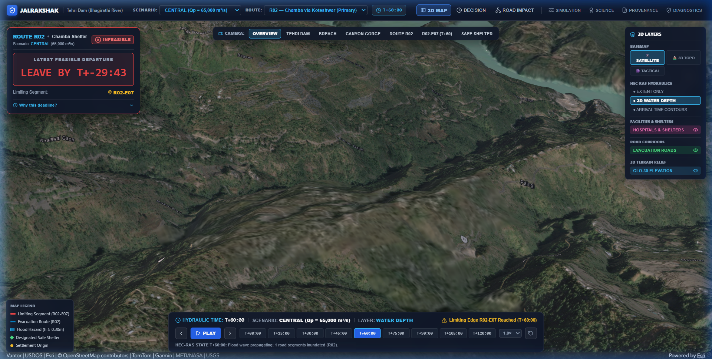
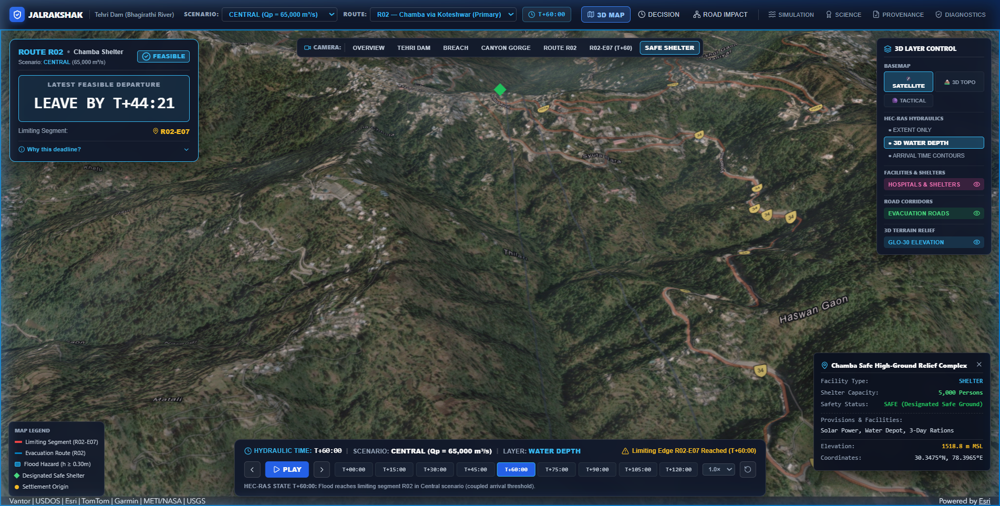
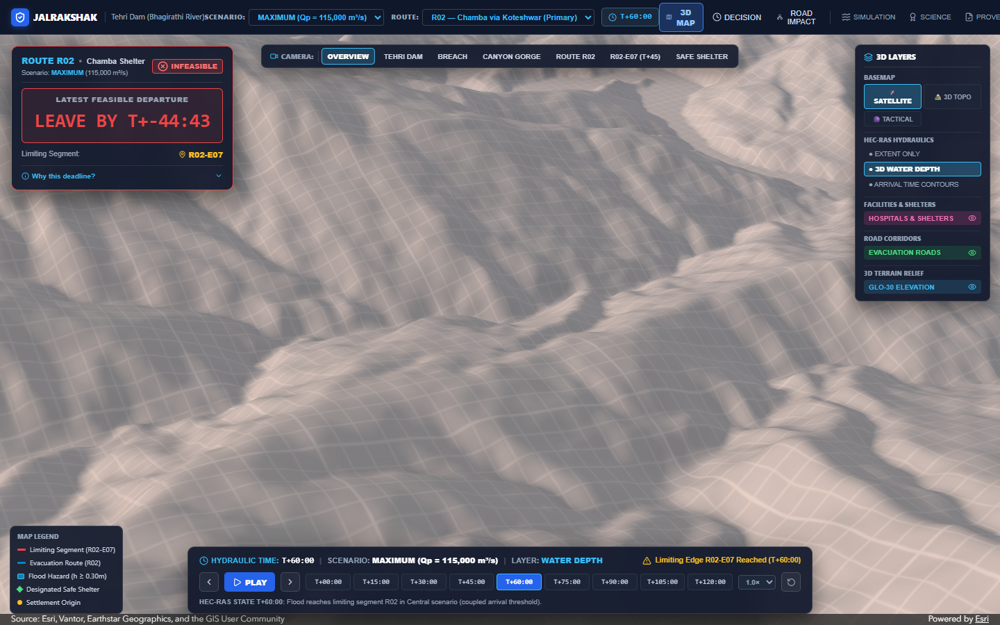
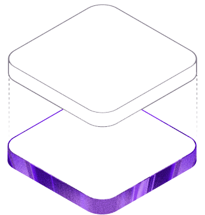
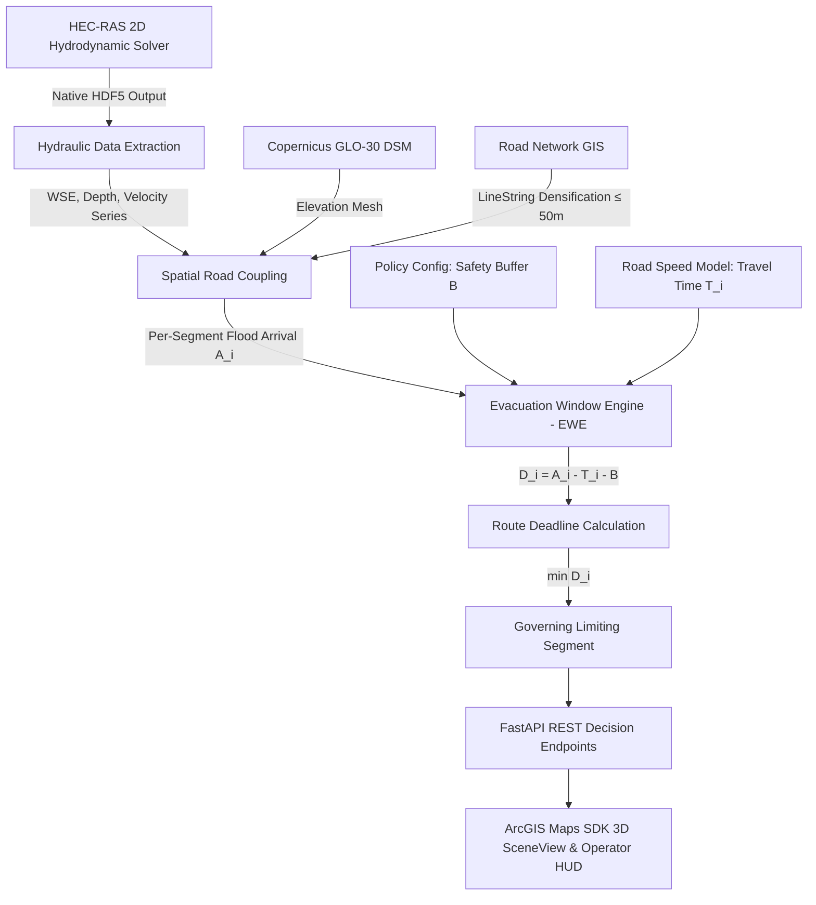
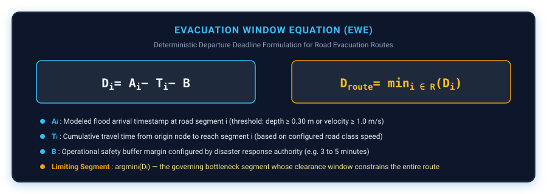

# JalRakshak (जल रक्षक)

> **Physics-grounded Dam-Break Flood Inundation Modeling & Deterministic Evacuation Window Decision Engine**  
> *Developed for the Smart India Hackathon (SIH 2026) — Problem Statement SIH26161*

[](https://jalrakshak-frontend.onrender.com)
[](https://jalrakshak-api.onrender.com/docs)
[](docs/RELEASE_READINESS.md)
[](frontend/)
[](LICENSE)

---


### Quick Links
- **[Launch Live Web Prototype](https://jalrakshak-frontend.onrender.com)**
- **[Interactive API Documentation](https://jalrakshak-api.onrender.com/docs)**
- **[Watch Prototype Cinematic Simulation](frontend/public/simulation/jalrakshak_cinematic_h264.mp4)**
- **[Release Readiness Audit](docs/RELEASE_READINESS.md)**
- **[Forensic Repository Inventory](docs/REPOSITORY_AUDIT.md)**

---

## 1. The Problem

When catastrophic dam failure or severe breach occurs, 2D hydrodynamic models like **USACE HEC-RAS** simulate complex unsteady shallow-water wave mechanics, producing vast grid-level water surface elevations ($WSE$), depths ($h$), and velocity vectors ($v$).

**The Operational Gap:**  
Emergency response commanders and district magistrates in disaster control rooms do not have the time or specialized tools to parse millions of raw hydraulic mesh cells during an unfolding crisis. They face three urgent questions:
1. **Which downstream road segments will be submerged, and at what exact minute?**
2. **When is the absolute latest departure deadline before an evacuation route is permanently cut off?**
3. **Which road segment acts as the governing bottleneck?**

> **HEC-RAS models flood behaviour. Emergency officers need route-level evacuation decisions. JalRakshak bridges that gap.**

---

## 2. What JalRakshak Does

JalRakshak transforms raw, complex 2D hydrodynamic simulation results into actionable, mathematically deterministic evacuation clearance deadlines.

```
HEC-RAS 2D Unsteady Solver
          ↓
Native Hydrodynamic State (WSE, Depth, Velocity)
          ↓
Road-Hydraulic Spatial Coupling (KD-Tree 150m Search Corridor)
          ↓
Evacuation Window Engine (EWE)
          ↓
Actionable Decision ("LEAVE BY T+44:21 via Route Alternate 1")
```

- **WHERE**: Maps exact flood wave propagation over terrain and downstream road networks.
- **WHEN**: Calculates precise flood arrival timestamps for every discrete road segment.
- **WHICH ROUTE**: Evaluates multiple evacuation corridors between origin settlements and high-ground shelters.
- **WHY**: Isolates the exact governing bottleneck segment ($\operatorname{argmin} D_i$) with full mathematical transparency.

---

## 3. Prototype

The JalRakshak web interface provides real-time 3D geospatial visualization powered by the **ArcGIS Maps SDK for JavaScript** alongside deterministic decision cards:

| 01. Operational Overview | 02. 3D Flood Simulation |
|---|---|
|  |  |
| *Full Tehri study area with real-time road status & active breach telemetry.* | *Unsteady flood wave progression mapped across 3D Copernicus GLO-30 terrain.* |

| 03. Road-Hydraulic Impact | 04. Evacuation Decision Panel |
|---|---|
|  |  |
| *Color-coded road hazard status ($d \ge 0.3\text{m}$, $v \ge 1.0\text{m/s}$) across network edges.* | *Deterministic departure deadlines, travel duration, and configured safety buffer.* |

| 05. Limiting Segment Inspection | 06. Multi-Scenario Comparison |
|---|---|
|  |  |
| *Interactive popup identifying the exact bottleneck edge governing evacuation clearance.* | *Comparative analysis across breach parameters (Central, Minimum, Maximum).* |

---

## 4. Live Prototype

| Service | Live URL | Description |
|---|---|---|
| **Frontend Web App** | **[jalrakshak-frontend.onrender.com](https://jalrakshak-frontend.onrender.com)** | Interactive 3D Decision Support Application |
| **Backend REST API** | **[jalrakshak-api.onrender.com](https://jalrakshak-api.onrender.com)** | FastAPI Decision Engine & GeoJSON Layer Provider |
| **API Interactive Docs** | **[jalrakshak-api.onrender.com/docs](https://jalrakshak-api.onrender.com/docs)** | OpenAPI / Swagger Interface |
| **Liveness Health Check** | **[jalrakshak-api.onrender.com/health/live](https://jalrakshak-api.onrender.com/health/live)** | Backend Health Endpoint |
| **Readiness Health Check** | **[jalrakshak-api.onrender.com/health/ready](https://jalrakshak-api.onrender.com/health/ready)** | System Diagnostic & Engine Status |

*Note: This is an academic/hackathon prototype deployment hosted on Render's cloud tier. Please allow a brief cold-start spin-up on first request.*

---

## 5. Demo Video

[](frontend/public/simulation/jalrakshak_cinematic_h264.mp4)

> *Click the thumbnail above to view the high-definition cinematic simulation of the Tehri Dam-Break scenario, showing flood wavefront propagation and route clearance windows.*

---

## 6. How It Works

JalRakshak's computational pipeline operates deterministically without speculative AI in the life-critical decision loop:



---

## 7. Evacuation Window Engine (EWE)

The core mathematical contribution of JalRakshak is the **Evacuation Window Equation (EWE)**:

$$\boxed{D_i = A_i - T_i - B}$$

$$\boxed{D_{\text{route}} = \min_{i \in \mathcal{R}} \left( D_i \right)}$$

$$\boxed{\text{Limiting Segment} = \operatorname{argmin}_{i \in \mathcal{R}} \left( D_i \right)}$$



### Equation Terms
- **$A_i$ (Flood Arrival Timestamp):** The exact simulation timestamp when water depth on segment $i$ reaches the critical hazard threshold ($h \ge 0.30\text{ m}$ or $v \ge 1.0\text{ m/s}$).
- **$T_i$ (Cumulative Travel Duration):** The time required for a vehicle departing at $t_0$ to travel from the evacuation origin along the route to segment $i$:
  $$T_i = \sum_{k=1}^{i} \frac{L_k}{v_{\text{road}}(k)}$$
- **$B$ (Configured Safety Buffer):** An operational margin (e.g., $3$ to $5\text{ minutes}$) set by emergency planners to account for vehicle boarding and road friction.
- **$D_{\text{route}}$ (Latest Feasible Departure Deadline):** The latest possible time a vehicle can leave the origin and still clear every segment along the route before flood inundation.
- **Limiting Segment:** The bottleneck segment that produces the minimum deadline and strictly constrains the entire route.

---

## 8. Scenario-Dynamic Architecture

JalRakshak features a **Scenario-Scoped World Architecture** (RC3.2) where each scenario manifest is the complete authoritative source for its geographic environment:

```
Scenario Manifest
       ↓
Scenario Context (Immutable, Request-Scoped)
   ┌───┼──────────┬──────────┐
   ↓   ↓          ↓          ↓
Roads Points  Hydraulics  Terrain
   │   │          │          │
   └───┴──────────┼──────────┘
                  ↓
          Spatial Coupling
                  ↓
       Evacuation Window Engine
                  ↓
          Frontend SceneView
```

- **Manifest Authority:** Scenarios explicitly declare their own roads (`roads.json`), evacuation points (`evacuation_points.json`), edge hydraulics (`edge_hydraulics.json`), and inundation extents (`inundation.geojson`).
- **Zero Silent Fallbacks:** Missing or corrupted scenario artifacts return explicit `SCENARIO_DATA_UNAVAILABLE` errors rather than silently defaulting to global study area files.
- **Concurrency Isolation:** Multiple scenarios run concurrently across parallel asynchronous workers without shared memory cross-contamination.
- **Tested Worlds:** Verified end-to-end using autonomous synthetic worlds (`TEST_ALPHA` with edges $X01..X03$ and `TEST_BETA` with edges $Y01..Y03$).

---

## 9. Verification Evidence

Every component in JalRakshak is backed by automated, reproducible test suites:

| Verification Target | Test Suite / Benchmark | Result | Status |
|---|---|:---:|:---:|
| **Backend Automated Tests** | Pytest Unit, Integration & Concurrency Suites | **215 Passed, 1 Skipped** | **VERIFIED** |
| **Frontend Production Build** | TypeScript 5.6 / Vite Production Bundle | **0 Errors, 0 Warnings** | **VERIFIED** |
| **Scenario GIS Isolation** | Multi-World Concurrency (30 Parallel Threads) | **100% Isolated** | **VERIFIED** |
| **Authoritative Scenarios** | Frozen Gate 3B 15km Tehri Models (`CENTRAL`, `MINIMUM`, `MAXIMUM`) | **Validated** | **VERIFIED** |
| **Synthetic Test Worlds** | `TEST_ALPHA` ($X01..X03$) & `TEST_BETA` ($Y01..Y03$) Data-Only Ingestion | **100% Functional** | **VERIFIED** |
| **Analytical Benchmark** | Ritter Dam-Break Analytical Shallow-Water Solution | **$\text{Err} < 1\%$** | **VERIFIED** |
| **Code Hygiene Audit** | Regex Anti-Hardcode Scanner across Source Tree | **0 Leaks Found** | **VERIFIED** |

---

## 10. Example Operational Decision

### Scenario: `SCENARIO_CENTRAL` (Tehri Dam Baseline Overtopping, $Q_p = 65,000\text{ m}^3\text{/s}$)
- **Evacuation Route:** Malidewal Settlement $\to$ Chamba High-Ground Shelter (Route `R02`)
- **Modeled Flood Arrival at Limiting Segment ($A_{\text{lim}}$):** $T+60:00$ ($3600\text{ s}$)
- **Cumulative Vehicle Travel Time ($T_{\text{lim}}$):** $12:39$ ($759\text{ s}$)
- **Configured Emergency Safety Buffer ($B$):** $03:00$ ($180\text{ s}$)

$$\text{Latest Departure Deadline} = 60:00 - 12:39 - 03:00 = \mathbf{T+44:21}$$

- **Governing Bottleneck Segment:** `R02-E07` (Koteshwar Valley low-lying corridor)
- **Operational Directive:** **LEAVE BY T+44:21** to guarantee complete evacuation clearance before road cutoff.

---

## 11. Technology Stack

- **Frontend Application:** React 18, TypeScript, Vite, ArcGIS Maps SDK for JavaScript (`@arcgis/core`), Tailwind-free Custom Modern Design System.
- **Backend Services:** Python 3.12+, FastAPI, Uvicorn, Pydantic V2, NetworkX, Shapely, SciPy.
- **Hydrodynamic Modeling:** USACE HEC-RAS 2D (Unsteady Shallow-Water Equations, HDF5 Output).
- **Geospatial & Terrain:** Copernicus GLO-30 DSM, GeoJSON, EPSG:32644 (UTM Zone 44N) projection pipeline.
- **Deployment Platform:** Render Cloud Platform (FastAPI Web Service + Static Site CDN).

---

## 12. Repository Structure

```
JalRakshak/
├── backend/                  # FastAPI Python backend service
│   ├── app/
│   │   ├── api/              # REST API endpoints & routers
│   │   ├── core/             # Operational configuration
│   │   ├── domain/           # EWE Engine, HEC-RAS Adapter, Spatial Mapper
│   │   └── telemetry/        # Health checks, audit logging, event bus
│   ├── requirements.txt      # Production Python dependencies
│   └── tests/                # Automated pytest suites
├── frontend/                 # React 18 TypeScript web application
│   ├── src/
│   │   ├── components/       # Decision panels, timeline scrubbers, modals
│   │   ├── map3d/            # ArcGIS SceneView & dynamic GIS layers
│   │   ├── services/         # API client & decision stores
│   │   └── views/            # Operational map, simulation & validation views
│   ├── public/               # Static assets, DEM tiles & simulation video
│   └── package.json          # Node dependencies & build scripts
├── data/                     # Authoritative study area datasets & scenarios
│   ├── study_area/           # Tehri baseline roads, settlements, dam GIS
│   └── scenarios/            # Scenario manifests (CENTRAL, TEST_ALPHA, TEST_BETA)
├── docs/                     # Technical specifications, audits & visual evidence
│   ├── images/               # Architecture SVGs, screenshots & thumbnails
│   ├── REPOSITORY_AUDIT.md   # Complete repository inventory audit
│   └── RELEASE_READINESS.md  # SIH 2026 Release Readiness report
├── render.yaml               # Multi-service Render deployment specification
└── Dockerfile                # Standalone container deployment
```

---

## 13. Local Development

### Prerequisites
- Python 3.11+ (Python 3.12 recommended)
- Node.js 18+ and npm

### 1. Backend Setup
```bash
# From repository root:
python -m venv .venv
source .venv/bin/activate       # On Windows: .venv\Scripts\activate
pip install -r backend/requirements.txt

# Start FastAPI dev server on port 8000:
python -m uvicorn backend.app.main:app --host 0.0.0.0 --port 8000 --reload
```

### 2. Frontend Setup
```bash
# In a new terminal:
cd frontend
npm ci
npm run dev
```
Open **[http://localhost:5173](http://localhost:5173)** in your browser.

### 3. Run Automated Tests
```bash
# Run full backend and architectural test suite:
pytest backend/tests tests -v
```

---

## 14. Cloud Deployment (Render)

JalRakshak includes a native [`render.yaml`](render.yaml) blueprint for automated multi-service deployment:

1. Connect your GitHub repository to **[Render](https://render.com)**.
2. Create a new **Blueprint** and select `render.yaml`.
3. Set the environment variables:
   - `CORS_ORIGINS`: `https://jalrakshak-frontend.onrender.com`
   - `VITE_API_BASE_URL`: `https://jalrakshak-api.onrender.com/api/v1`
4. Deploy!

---

## 15. Scientific Scope & Data Categorization

To maintain complete research honesty and academic rigor, JalRakshak categorizes all project data:

1. **Authoritative Hydrodynamics:** Native 2D unsteady shallow-water simulation outputs from HEC-RAS 7.0.1 (`.p01.hdf`) for the 15km Tehri valley domain.
2. **Derived Geospatial State:** Discrete road segment flood arrival timestamps ($A_i$), peak depths, and velocities computed via deterministic spatial search corridors.
3. **Configured Engineering Assumptions:** Evacuation speeds by road classification, safety buffer durations, and critical depth hazard limits ($0.30\text{ m}$).
4. **Synthetic Architecture Test Fixtures:** Worlds `TEST_ALPHA` and `TEST_BETA` are synthetic data fixtures built to verify autonomous multi-world GIS ingestion and do not represent real-world physical events.

---

## 16. Transparent Limitations

- **Static Speed Model:** Evacuation travel times currently use static road-class velocities and do not simulate dynamic microscopic traffic congestion or driver panics.
- **Vertical Datum Conditioning:** Digital surface models (GLO-30) use satellite-resampled river valley geometry without fine-scale bathymetric soundings.
- **Physical Event Calibration:** While benchmarked against Ritter analytical solutions, the Tehri hydrodynamic models represent computational simulations rather than historical post-disaster survey data.
- **Prototype Status:** JalRakshak is an engineering research prototype designed for hackathon evaluation and disaster management research.

---

## 17. Project Roadmap

- [ ] **Dynamic Traffic Integration:** Coupling with macroscopic/mesoscopic traffic flow simulators (e.g. SUMO) to model queue buildup.
- [ ] **Drone & Satellite SAR Inundation Feeds:** Live assimilation of Sentinel-1 SAR flood masks to update active hydraulic states during disasters.
- [ ] **Multi-Dam Cascading Failures:** Chained breach hydrograph propagation for upstream-downstream reservoir networks.
- [ ] **Edge Offline Packaging:** Compact offline execution container for deployment on district emergency satellite laptops.

---

## 18. Project Team

*Team JalRakshak — Smart India Hackathon (SIH 2026)*

- **Lead Architecture & Hydrodynamic Modeling:** Abdul K.
- **Geospatial Engineering & Frontend Development:** JalRakshak Team Contributors

---

## 19. SIH Problem Statement

- **Problem ID:** `SIH26161`
- **Category:** Disaster Management / AI, ML & Geospatial Applications
- **Domain:** Dam-Break Flood Inundation Modeling & Evacuation Route Decision Support

---

## 20. License

This project is licensed under the **MIT License** — see the [LICENSE](LICENSE) file for details.
