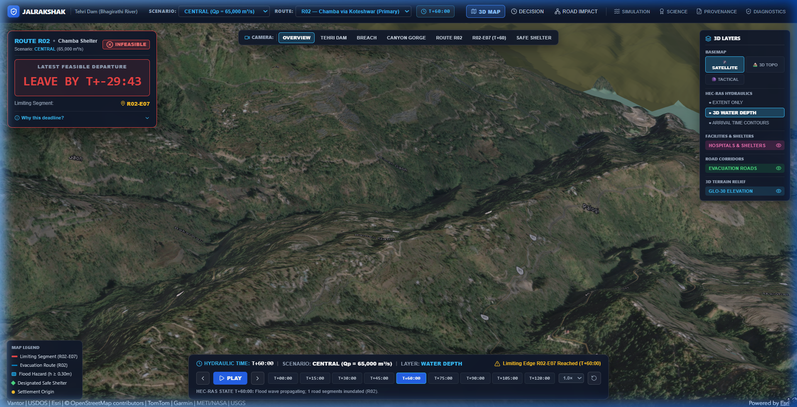

# JalRakshak (जल रक्षक)

> **Physics-Grounded Dam-Break Hydrodynamic Inundation Modeling & Evacuation Window Decision Support System**  
> *Developed for the Smart India Hackathon (SIH 2026) — Problem Statement ID: SIH26161*

[](https://jalrakshak-frontend.onrender.com)
[](https://jalrakshak-api.onrender.com/docs)
[](docs/FINAL_SIH26161_GAP_REPORT.md)
[](frontend/)
[](LICENSE)

---



### Key Project Links & Verification Audits
- **[Launch Live Web Prototype](https://jalrakshak-frontend.onrender.com)**
- **[Interactive API Documentation](https://jalrakshak-api.onrender.com/docs)**
- **[SIH26161 Requirement Traceability Matrix](docs/SIH26161_REQUIREMENT_TRACEABILITY.md)**
- **[Presentation Evidence Package](docs/PRESENTATION_EVIDENCE.md)**
- **[Final SIH26161 Gap & Verification Report](docs/FINAL_SIH26161_GAP_REPORT.md)**
- **[Scientific Boundaries & Operational Limitations](docs/SCIENTIFIC_LIMITATIONS.md)**
- **[Contributors & Multi-Author Attribution](CONTRIBUTORS.md)**

---

## 1. Problem Statement: SIH26161

**Title:** Dam Break Inundation Modelling Using Hydrodynamic Modelling of any River  
**Authority:** National Technical Research Organisation (NTRO) / Ministry of Education's Innovation Cell (MIC)  
**Category:** Disaster Management / AI, ML & Geospatial Applications  

### The Operational Challenge
When severe breach or high-volume spillway release occurs at a major dam (e.g. Tehri Dam on the Bhagirathi River), 2D hydrodynamic models like **USACE HEC-RAS** simulate complex unsteady shallow-water wave mechanics, producing massive grids of water surface elevations ($WSE$), depths ($h$), and velocity vectors ($v$).

**The Decision-Support Gap:**  
Emergency response commanders and district magistrates in disaster control rooms do not have the time or specialized GIS tools to parse raw hydraulic mesh cells during an unfolding catastrophe. They face five immediate operational questions:
1. **WHERE:** Which downstream communities and road networks are in the flood path?
2. **WHEN:** At what exact minute does the flood wave reach each critical road corridor?
3. **HOW MUCH TIME:** What is the absolute latest departure deadline before an evacuation route is submerged?
4. **WHICH SEGMENT:** Which road segment acts as the governing evacuation bottleneck?
5. **WHY:** What mathematical and hydraulic conditions dictate the decision?

> **HEC-RAS models the flood. JalRakshak translates the hydraulic result into an authoritative, life-saving operational evacuation decision.**

---

## 2. Core System Architecture

```
                               ┌──────────────────────────────────────────────┐
                               │  Dam Breach / Inflow Hydrograph (HEC-RAS 2D) │
                               │   (Central 65k / Min 28.5k / Max 115k m³/s)  │
                               └──────────────────────┬───────────────────────┘
                                                      │ Native HDF5 Output
                                                      ▼
                               ┌──────────────────────────────────────────────┐
                               │      Native Hydrodynamic Results Engine      │
                               │   - Water Surface Elevation (WSE)            │
                               │   - Water Depth h = max(0, WSE - z_cell)     │
                               │   - Wave Arrival Time t_arr (h ≥ 0.30 m)     │
                               │   - Face Velocity Magnitude v (m/s)          │
                               └──────────────────────┬───────────────────────┘
                                                      │
                       ┌──────────────────────────────┴──────────────────────────────┐
                       ▼                                                             ▼
        ┌─────────────────────────────┐                               ┌─────────────────────────────┐
        │ 3D Geospatial Visualization │                               │  Road-Hydraulic Coupling    │
        │ - ArcGIS Maps SDK SceneView │                               │  - 150m Search Corridor     │
        │ - GLO-30 Terrain Elevation  │                               │  - KD-Tree Spatial Index    │
        │ - Depth & Arrival Isochrones│                               │  - Per-Edge Arrival Time    │
        └─────────────────────────────┘                               └──────────────┬──────────────┘
                                                                                     │
                                                                                     ▼
                                                                      ┌─────────────────────────────┐
                                                                      │ Evacuation Window Engine    │
                                                                      │ D_i = A_i - T_i - B         │
                                                                      │ D_deadline = min_i(D_i)     │
                                                                      │ Bottleneck: argmin_i(D_i)   │
                                                                      └──────────────┬──────────────┘
                                                                                     │
                                                                                     ▼
                                                                      ┌─────────────────────────────┐
                                                                      │ Emergency Officer Decision  │
                                                                      │ - Route Status              │
                                                                      │ - Departure Deadline        │
                                                                      │ - Limiting Road Segment     │
                                                                      │ - Full Provenance Lineage   │
                                                                      └─────────────────────────────┘
```

---

## 3. Mathematical Evacuation Window Engine (EWE)

For any candidate evacuation route comprised of ordered road edges $e_1, e_2, \dots, e_n$:

1. **Cumulative Traversal Time ($T_i$):**
   $$T_i = \sum_{k=1}^{i} \frac{L_k}{v_k}$$
   where $L_k$ is segment length (m) and $v_k$ is vehicle speed (m/s).

2. **Flood Wave Arrival Time ($A_i$):**
   $$A_i = \min \{ t \mid h(e_i, t) \ge 0.30\text{ m} \lor v(e_i, t) \ge 1.0\text{ m/s} \}$$

3. **Latest Feasible Departure Deadline ($D_{\text{deadline}}$):**
   $$D_{\text{deadline}} = \min_{i \in \{1, \dots, n\}} (A_i - T_i - B)$$
   where $B$ is the emergency officer's configured safety buffer (default $3.0\text{ min} = 180\text{ s}$).

4. **Governing Limiting Road Segment:**
   $$e_{\text{limiting}} = \arg\min_{i \in \{1, \dots, n\}} (A_i - T_i - B)$$

### Deterministic Operational Classifications
- **`FEASIBLE`**: $D_{\text{deadline}} \ge 300\text{ s}$ ($5\text{ minutes}$ margin).
- **`LOW MARGIN`**: $0\text{ s} \le D_{\text{deadline}} < 300\text{ s}$ (Evacuate immediately).
- **`INFEASIBLE`**: $D_{\text{deadline}} < 0\text{ s}$ (Route cut off before complete clearance).
- **`DATA GAP`**: Produced strictly when hydraulic or road data is missing. Never replaced with synthetic numbers.

---

## 4. Supported Input Datasets & Standards

| Input Type | Supported Format / Standard | Source & Technical Specifications |
|---|---|---|
| **Terrain Elevation** | GeoTIFF / DEM / DSM | Copernicus GLO-30 Global DEM (30m resolution, EPSG:32644). |
| **Hydrodynamic Meshes** | HEC-RAS Plan HDF5 (`.p01.hdf` to `.p03.hdf`) | 2D unsteady shallow water equations with cell center coordinates and face connectivity. |
| **Road Networks** | GeoJSON (RFC 7946) / OSM | OpenStreetMap road centerlines with speed limits, road class, and lane geometry. |
| **Settlements & Shelters** | GeoJSON (RFC 7946) / Vector | Population points, evacuation origins, and high-ground relief centers. |
| **Satellite Remote Sensing** | Google Earth Engine (GEE) / SAR | Sentinel-1 GRD SAR (C-band backscatter) and Sentinel-2 MSI multispectral imagery. |

---

## 5. GIS Output Export Pipeline

JalRakshak provides genuine export endpoints conforming to international geospatial standards:
- **RFC 7946 GeoJSON:** Multi-layer geometries for inundation polygons, road impacts, and evacuation routes.
- **OGC KML 2.2 XML:** 3D styled keyhole markup files with embedded hydraulic attributes and elevation data for Google Earth.
- **REST Endpoints:**
  - `GET /api/v1/scenarios/{id}/export?layer=inundation&format=geojson|kml`
  - `GET /api/v1/scenarios/{id}/export?layer=roads&format=geojson|kml`
  - `GET /api/v1/scenarios/{id}/verify-provenance` (Real SHA-256 disk artifact verification)

---

## 6. Physical Exposure & Loss Analysis

The system enforces strict scientific separation between:
1. **Physical Exposure:** Spatial intersection of flood waters ($h \ge 0.30\text{ m}$) with settlements, roads, and critical infrastructure.
2. **Empirical Vulnerability:** Depth-Damage Functions (DDF) based on HAZUS-MH and Central Water Commission (CWC) guidelines:
   - Asset classes: `RESIDENTIAL`, `COMMERCIAL`, `CRITICAL_FACILITY`, `ROAD_NETWORK`.
   - Structural damage ratios ($0.0 \to 1.0$) with $\pm 15\%$ empirical uncertainty bounds.
   - **Zero Fabrication Policy:** No arbitrary rupee losses are claimed without calibrated local cadastral surveys.

---

## 7. Multi-Hydrodynamic-Model Architecture

| Model Adapter | Mathematical Solver | Status in JalRakshak | Active Scenarios |
|---|---|---|---|
| **HEC-RAS 2D** | Eulerian Finite Volume Shallow Water | `AUTHORITATIVE_INGESTED` | `SCENARIO_CENTRAL`, `SCENARIO_MINIMUM`, `SCENARIO_MAXIMUM` |
| **Delft3D FM** | Eulerian Flexible Mesh NetCDF | `NOT_CONFIGURED` (Interface Implemented) | Available via NetCDF ingestion |
| **DualSPHysics (SPH)** | Lagrangian Meshless Particle Formulation | `NOT_CONFIGURED` (Interface Implemented) | Available via VTK/Bi4 particle ingestion |

---

## 8. Google Earth Engine (GEE) Remote Sensing

- **Provider:** `backend/app/integrations/gee/` with `GEEAuthProvider`, `GEEQueryBuilder`, and `FloodExtentComparator`.
- **Spatial Metrics:** Computes exact Intersection over Union (IoU), Precision, Recall, and F1-score between observed satellite flood masks and 2D hydraulic simulation meshes.
- **Disclaimer:** Satellite observations reflect surface roughness at satellite overpass time; they represent observational discrepancy analysis rather than automatic solver recalibration.

---

## 9. Demonstration Study Area: Tehri Dam

- **Location:** Bhagirathi River, Tehri Garhwal, Uttarakhand, India (`30.378°N, 78.480°E`).
- **Dam Type:** Earth and rock-fill dam (Height: 260.5m, Crest Length: 575m).
- **Simulated Scenarios:**
  1. **Central Baseline:** $Q_p = 65,000\text{ m}^3/\text{s}$ (Arrival at Koteshwar: $T+60:00$, Deadline: $T+44:21$).
  2. **Minimum Breach:** $Q_p = 28,500\text{ m}^3/\text{s}$ (Delayed breach wave propagation).
  3. **Maximum Breach:** $Q_p = 115,000\text{ m}^3/\text{s}$ (Rapid failure / extreme overtopping).

---

## 10. Verified Scientific Boundaries & Limitations

1. **Physical Calibration:** Unestablished for Tehri Dam due to the absence of historical dam failure event records.
2. **Elevation Surface:** Copernicus GLO-30 is a 30m Digital Surface Model containing vegetation canopy and structure artifacts.
3. **Traffic Dynamics:** Vehicle speeds ($50\text{ km/h}$) are configured static parameters; dynamic traffic congestion is unmodelled.
4. **Vertical Datum:** Geoid-to-ellipsoid vertical datum offset is uncalibrated between GLO-30 (EGM96) and local riverbed gauge datums.
5. **Limiting Edge Definition:** Represents the mathematical bottleneck $\arg\min_i(A_i - T_i - B)$, not physical structural road failure.

---

## 11. Project Team

*Developed by Team JalRakshak — Smart India Hackathon (SIH 2026)*

| Team Member | Role / Domain | GitHub Profile | Contact | Core Responsibilities |
|---|---|---|---|---|
| **Mohammad Abdul Kalam Hussain** | Team Lead / ML Engineer | [@abdul05kh](https://github.com/abdul05kh) | `abdul05kh.college@gmail.com` | System architecture, EWE mathematical formulation, HEC-RAS 2D unsteady integration, end-to-end pipeline coordination. |
| **Siri Chandana** | Hydrodynamic / GIS Specialist | [@kotagirisirichandana](https://github.com/kotagirisirichandana) | `kotagirisirichandana73@gmail.com` | Hydrodynamic boundary conditions, GLO-30 terrain conditioning, geospatial coordinate projection, inundation mesh modeling. |
| **Mohammad Zakiruddin** | Frontend Developer | [@zakirverse](https://github.com/zakirverse) | `zakirmd.1805@gmail.com` | React + Vite UI architecture, ArcGIS Maps SDK 3D SceneView integration, interactive hydraulic controllers, responsive dashboard. |
| **Mohammed Numan** | AI Engineer | [@mohammednumaan716](https://github.com/mohammednumaan716) | `mohammednumaan901@gmail.com` | Intelligent routing analysis, surrogate model research, automated parameter optimization, decision logic validation. |
| **Manivarun Chintala** | Data Infrastructure / Backend Developer | [@manivarun-05](https://github.com/manivarun-05) | `manivarunchintala2005.2728@gmail.com` | FastAPI REST endpoints, multi-scenario spatial indexing, KD-Tree road-hydraulic mapping pipeline, cloud deployment. |
| **Thaniska** | QA & Verification Lead | [@thanishkaX](https://github.com/thanishkaX) | `ramatenkithanishka@gmail.com` | Pytest test suite, mathematical edge case validation, scenario isolation verification, end-to-end acceptance testing. |

---

## 12. Local Development & Installation

### Backend Setup (FastAPI + Python 3.10+)
```bash
# Clone the repository
git clone https://github.com/abdul05kh/JalRakshak.git
cd JalRakshak

# Create and activate virtual environment
python -m venv venv
venv\Scripts\activate  # Windows

# Install dependencies
pip install -r backend/requirements.txt

# Start FastAPI server
uvicorn backend.app.main:app --host 0.0.0.0 --port 8000 --reload
```

### Frontend Setup (React 18 + Vite + TypeScript)
```bash
cd frontend

# Install node dependencies
npm install

# Start Vite dev server
npm run dev
```

### Run Test Suites
```bash
# Run backend test suite (189 tests)
python -m pytest backend/tests -v

# Run frontend build verification
cd frontend && npm run build
```

---

## 13. License

This project is licensed under the **MIT License** — see the [LICENSE](LICENSE) file for details.
