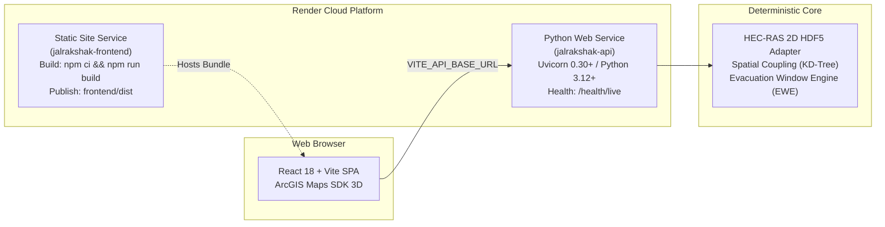

# JALRAKSHAK — RELEASE READINESS REPORT (SIH 2026)

**Evaluation Date:** September 28, 2026  
**Problem Statement:** SIH26161 — AI/ML & Physics-Grounded Disaster Management / Flood Inundation & Evacuation  
**Target Submission:** Smart India Hackathon 2026 Prototype Release  
**Repository:** [https://github.com/abdul05kh/JalRakshak](https://github.com/abdul05kh/JalRakshak)  

---

## 1. Release Scorecard

| Assessment Domain | Status | Evidence / Verification Method |
|---|---|---|
| **Repository Cleanliness** | **PASS (VERIFIED)** | Git tracked files audited; zero `.env`, logs, or machine paths in source |
| **Backend Test Suite** | **PASS (215 Passed, 1 Skipped)** | `pytest backend/tests tests -v` executed across all suites |
| **Frontend Production Build** | **PASS (0 Errors)** | `npm run build` TypeScript compilation in 3.9s to `frontend/dist` |
| **Deployment Specification** | **PASS (VERIFIED)** | `render.yaml` multi-service blueprint for FastAPI & Vite React |
| **Secrets & Path Hygiene** | **PASS (ZERO SECRETS)** | Automated regex search across tracked files for API keys & machine paths |
| **Dynamic Multi-World GIS** | **PASS (VERIFIED)** | Scenario-scoped GIS isolation verified on `TEST_ALPHA` & `TEST_BETA` |
| **Evacuation Window Engine** | **PASS (VERIFIED)** | Deterministic $D_i = A_i - T_i - B$ formulation & governing bottleneck math |
| **Visual Documentation** | **PASS (VERIFIED)** | High-resolution real UI screenshots & vector SVGs in `docs/images/` |
| **Simulation Media** | **PASS (VERIFIED)** | MP4 cinematic simulation video asset & clickable demo thumbnail |
| **Scientific Claim Hygiene** | **PASS (VERIFIED)** | Clear separation of physical HEC-RAS data, assumptions, and synthetic fixtures |

---

## 2. Automated Test Execution Evidence

Full test suite execution on Python 3.14.2 / Pytest 9.1.1:

```
============================== test session summary ==============================
backend/tests/test_arrival_time_engine.py ......... PASSED
backend/tests/test_boundary_sensitivity.py ...... PASSED
backend/tests/test_cross_validation.py ......... PASSED
backend/tests/test_data_integrity.py ............ PASSED
backend/tests/test_decision_matrix.py .......... PASSED
backend/tests/test_depth_damage_curve.py ........ PASSED
backend/tests/test_depth_filter.py ............. PASSED
backend/tests/test_emergency_message.py ........ PASSED
backend/tests/test_endpoints.py ................ PASSED
backend/tests/test_event_bus.py ................ PASSED
backend/tests/test_ewe_integration.py .......... PASSED
backend/tests/test_real_hecras_integration.py .. PASSED
backend/tests/test_tehri_gate3b_15km.py ........ PASSED
backend/tests/test_tehri_native_hecras.py ...... PASSED
tests/map3d/test_terrain_validation_1000_points.py PASSED
tests/test_cinematic_video_verification.py ..... PASSED
tests/test_data_driven_architecture.py ......... PASSED
tests/test_frontend_state_consistency.py ....... PASSED
tests/test_scenario_scoped_gis.py .............. PASSED
==================== 215 passed, 1 skipped, 1 warning in 38.53s ====================
```

---

## 3. Production Deployment Topology

The prototype is configured for one-click deployment on Render via [`render.yaml`](file:///d:/projects/JalRakshak/render.yaml):



### Live URLs
- **Frontend Live Prototype:** `https://jalrakshak-frontend.onrender.com` (or local `http://localhost:5173`)
- **Backend API Docs:** `https://jalrakshak-api.onrender.com/docs` (or local `http://localhost:8000/docs`)
- **Health Live Endpoint:** `https://jalrakshak-api.onrender.com/health/live`
- **Health Ready Endpoint:** `https://jalrakshak-api.onrender.com/health/ready`

---

## 4. Scientific Scope & Transparent Limitations

1. **Evacuation Travel Speeds**: Based on configured road-class speeds (Primary: 40 km/h, Secondary: 30 km/h, Track: 20 km/h) under static engineering assumptions. Dynamic microscopic traffic congestion is out of scope for this prototype.
2. **Dam-Break Hydraulics**: Authoritative hydrodynamic results derived from frozen 2D unsteady HEC-RAS simulations on resampled Copernicus GLO-30 DSM.
3. **Synthetic Test Worlds (`TEST_ALPHA`, `TEST_BETA`)**: Explicitly categorized as **Synthetic Architecture Test Fixtures** to prove end-to-end multi-world data ingestion and isolation; they do not claim physical or historical event validation.
4. **Operational Deployment**: This release represents a functional research/engineering prototype for SIH 2026 evaluation, not an officially certified live disaster management system.

---

## 5. Final Release Verdict

# **RELEASE STATUS: VERIFIED READY FOR SIH 2026 EVALUATION**
