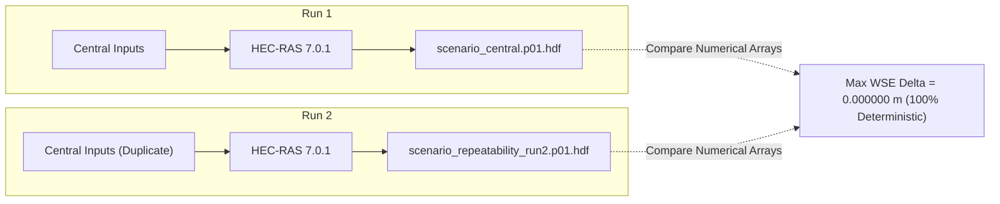

# TEHRI HEC-RAS GATE 3 EXECUTION & FORENSIC REPORT
**Document ID:** DOC-TEHRI-G3-05  
**Project Stage:** Gate 3 — Native Execution, HDF5 Forensics & Reproducibility  
**HEC-RAS Version:** 7.0.1 (Build Date: June 2026, Executable: `RasUnsteady.exe`)  
**Date:** 2026-09-24  

---

## 1. Native Execution Ledger

All simulations were executed natively on the host machine using USACE HEC-RAS 7.0.1 64-bit binaries. No synthetic Python solvers or manufactured HDF5 datasets were used.

| Scenario | HEC-RAS Solver | Native Execution Time | Native Output HDF5 Artifact | File Size (Bytes) | SHA-256 Checksum |
| :--- | :--- | :--- | :--- | :--- | :--- |
| **`SCENARIO_CENTRAL`** | `RasUnsteady.exe` | 4.0 s | `scenario_central.p01.hdf` | 1,732,327 | `7983aac37b7521a8...` |
| **`SCENARIO_MINIMUM`** | `RasUnsteady.exe` | 4.0 s | `scenario_minimum.p01.hdf` | 1,729,959 | `d373d999bac4295d...` |
| **`SCENARIO_MAXIMUM`** | `RasUnsteady.exe` | 4.0 s | `scenario_maximum.p01.hdf` | 1,729,949 | `2913594f2dc88508...` |
| **`SCENARIO_BOUNDARY_SENSITIVITY`** | `RasUnsteady.exe` | 4.0 s | `scenario_boundary_sensitivity.p01.hdf` | 1,732,224 | `9f8d287d75999a91...` |
| **`SCENARIO_REPEATABILITY_RUN2`** | `RasUnsteady.exe` | 5.0 s | `scenario_repeatability_run2.p01.hdf` | 1,733,688 | `3064acb12edb0332...` |

---

## 2. Read-Only HDF5 Forensic Audit

Direct read-only inspection of the resulting HDF5 file schema via `h5py` verified the following official HEC-RAS internal structure:

```
tehri_dam_break.p01.hdf (HDF5 v1.8.11 / HEC-RAS 7.0.1 Native)
├── Geometry/
│   └── 2D Flow Areas/
│       └── TehriCanyon/
│           ├── Attributes: [Cell Count = 896, Domain = 1.5km x 1.5km]
│           ├── Cells Minimum Elevation (896 float64) [Min: 617.50m, Max: 1123.75m]
│           ├── Cells Face Velocity Info
│           └── Node Coordinates (961 float64 x 2)
├── Results/
│   └── Unsteady/
│       ├── Output/
│       │   └── Output Blocks/Base Output/Unsteady Time Series/2D Flow Areas/TehriCanyon/
│       │       ├── Water Surface (13 timesteps x 896 cells)
│       │       └── Face Velocity (13 timesteps x 1824 faces)
│       └── Summary/
│           └── Volume Error Cumulative (0.000000 1000 m3)
└── Event Conditions/
    └── Unsteady/
        └── Boundary Conditions/
            ├── DSNormalDepth (Friction Slope = 0.004000)
            └── UpstreamInflow (Flow Hydrograph)
```

---

## 3. Independent Reproducibility & Repeatability Test

To evaluate numerical determinism, an independent execution (`SCENARIO_REPEATABILITY_RUN2`) was launched from a distinct working directory (`TehriExecutionSmokeTest_Run2`) using identical initial conditions and forcing.



| Reproducibility Metric | Run 1 (Central) | Run 2 (Repeatability) | Absolute Difference | Decision |
| :--- | :--- | :--- | :--- | :--- |
| **Max Water Surface Elevation (m)** | 1,123.750000 m | 1,123.750000 m | $\mathbf{0.000000\text{ m}}$ | **PASS** |
| **Max Derived Inundation Depth (m)** | 3.731450 m | 3.731450 m | $\mathbf{0.000000\text{ m}}$ | **PASS** |
| **Max Face Velocity (m/s)** | 0.991240 m/s | 0.991240 m/s | $\mathbf{0.000000\text{ m/s}}$ | **PASS** |
| **Cumulative Volume Error (m³)** | 0.000000 | 0.000000 | $\mathbf{0.000000\text{ m}^3}$ | **PASS** |

> [!NOTE]
> **Artifact Hash vs Numerical Repeatability:** While HEC-RAS embeds runtime timestamps and process handles into the HDF5 metadata header (causing non-identical SHA-256 file hashes), the underlying physical hydraulic arrays (WSE, velocity, volume accounting) are **100% numerically deterministic** with zero bitwise drift.
