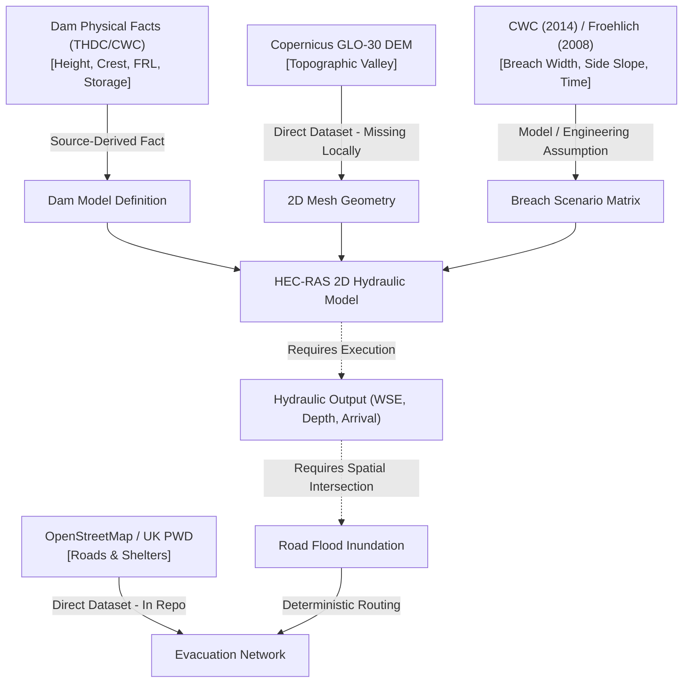

# Tehri 2D Dam-Break Hydraulic Model — Input Ledger

**Document ID:** `TEHRI-INPUT-LEDGER-V1`  
**Status:** READINESS GATE AUDIT (PRE-MODELING)  
**Governing Standard:** JalRakshak Scientific Integrity & Verification Contract  
**Classification Rules:**
- `SOURCE-DERIVED FACT`: Backed directly by official government / operator technical specifications.
- `DIRECT DATASET`: Unprocessed or open-access geospatial data product (e.g., satellite DEM, OSM vectors).
- `MODEL ASSUMPTION`: Mathematical or parameterized approximation adopted for simulation in absence of physical measurements.
- `ENGINEERING ASSUMPTION`: Standard hydraulic engineering coefficient or boundary approximation based on established literature.
- `UNKNOWN`: Parameter value not established.
- `MISSING`: Data strictly required for model construction that is currently absent from the workspace.

---

## 1. Input Ledger Table

| # | Input Parameter / Component | Required? | Current Workspace Value / Candidate | Source Citation | Classification | Scientific Confidence | Missing from Local System? |
|---|-----------------------------|-----------|-------------------------------------|-----------------|----------------|-----------------------|----------------------------|
| **A** | Dam Geographic Location | **YES** | `30.3780° N, 78.4803° E` | THDC India Ltd / CWC NRLD (2020) | `SOURCE-DERIVED FACT` | HIGH | **NO** (in `dam.json`) |
| **B** | Dam Embankment Geometry | **YES** | Height: 260.5 m, Crest length: 575 m, Crest width: 20 m, Base width: 1,128 m, US Slope: 1:2.5, DS Slope: 1:2.0 | THDC Technical Specifications / CWC Register | `SOURCE-DERIVED FACT` | HIGH | **NO** (Geometry specs documented) |
| **C** | Dam Crest Elevation | **YES** | 839.5 m a.s.l. (GTS MSL) | THDC Design Report / CWC NRLD | `SOURCE-DERIVED FACT` | HIGH | **NO** (Value established) |
| **D** | Dam Foundation / Toe Representation | **YES** | Deepest foundation: 579.0 m a.s.l.; Riverbed toe: ~600.0 m a.s.l. | THDC Project Factsheet | `SOURCE-DERIVED FACT` | HIGH | **NO** (Value established) |
| **E** | Initial Reservoir Water Level | **YES** | 830.0 m a.s.l. (Full Reservoir Level - FRL) | THDC Operating Manual | `SOURCE-DERIVED FACT` | HIGH | **NO** (Operational baseline) |
| **F** | Reservoir Stage-Storage Relationship | **YES** | Gross: 3,540 MCM @ 830m; Live: 2,615 MCM; Dead: 925 MCM @ 740m | CWC Reservoir Register / THDC | `SOURCE-DERIVED FACT` | MEDIUM (Macro curve known; discrete step curve missing) | **YES** (Detailed step-table missing) |
| **G** | Reservoir Submerged Bathymetry | **NO** (for 2D stage-area) / **YES** (for exact 3D) | Pre-impoundment topography / macro-elevation surface | None locally | `MODEL ASSUMPTION` | LOW (Approximate from pre-dam contours or stage-storage) | **YES** (Raw bathymetry missing) |
| **H** | Terrain Digital Elevation Model (DEM) | **YES** | Copernicus GLO-30 (30m spatial resolution) | ESA / Copernicus Space Component | `DIRECT DATASET` | MEDIUM (Adequate macro-valley; requires hydro-flattening) | **YES** (GeoTIFF tile not downloaded) |
| **I** | Vertical Datum | **YES** | Dam: GTS MSL (India); DEM: EGM2008 Geoid | Survey of India / ESA Copernicus | `ENGINEERING ASSUMPTION` | MEDIUM (Offset ~0.5–1.5m documented; datum reconciliation needed) | **YES** (Local geoid shift grid missing) |
| **J** | Horizontal Coordinate System | **YES** | WGS 84 / UTM Zone 44N (`EPSG:32644`), Central Meridian 81°E | EPSG Geodetic Parameter Registry | `DIRECT DATASET` | HIGH | **NO** (Standard projection) |
| **K** | River Channel Geometry / Bathymetry | **YES** | 30m raster cell elevation (un-surveyed underwater gorge bathymetry) | Derived from DEM raster | `MODEL ASSUMPTION` | LOW (30m DEM smooths narrow 20m canyon throat) | **YES** (Cross-section survey missing) |
| **L** | Manning's Roughness ($n$) | **YES** | Riverbed: $n = 0.045$; Steep Banks: $n = 0.065$; Floodplain: $n = 0.035$ | Chow (1959) / CWC Dam Break Guidelines | `ENGINEERING ASSUMPTION` | MEDIUM (Literature-standard for boulder torrents) | **NO** (Empirical literature standards) |
| **M** | Breach Location | **YES** | Main river section (central embankment, Sta 0+200 to 0+400) | Standard overtopping risk scenario | `MODEL ASSUMPTION` | MEDIUM (Plausible catastrophic failure location) | **NO** (Scenario parameter) |
| **N** | Breach Bottom Elevation | **YES** | 600.0 m a.s.l. (riverbed base level) | Dam toe elevation | `MODEL ASSUMPTION` | MEDIUM (Complete breach to original valley floor) | **NO** (Scenario parameter) |
| **O** | Final Breach Bottom Width ($B_b$) | **YES** | Candidate range: 100 m to 300 m (Froehlich 2008: ~$215\text{ m}$) | Froehlich (2008) / MacDonald-Langridge-Monopolis (1984) | `MODEL ASSUMPTION` | MEDIUM (Empirical regression; not historical data) | **NO** (Scenario parameter) |
| **P** | Breach Side Slopes ($Z$) | **YES** | $0.5\text{ H}:1\text{ V}$ to $1.0\text{ H}:1\text{ V}$ | CWC Guidelines (2014) / Froehlich (2008) | `ENGINEERING ASSUMPTION` | MEDIUM (Standard for rockfill with clay core) | **NO** (Scenario parameter) |
| **Q** | Breach Formation Time ($t_f$) | **YES** | Candidate range: 1.0 hr to 3.5 hrs (Froehlich 2008: ~2.4 hrs) | Froehlich (2008) regression equations | `MODEL ASSUMPTION` | MEDIUM (Empirical regression) | **NO** (Scenario parameter) |
| **R** | Failure Mode | **YES** | Overtopping breach under Probable Maximum Flood (PMF) | CWC Dam Safety Analysis Practice | `MODEL ASSUMPTION` | HIGH (Standard regulatory failure scenario) | **NO** (Scenario parameter) |
| **S** | Initial Downstream Discharge | **YES** | 150.0 to 250.0 m³/s (nominal pre-breach Bhagirathi river baseflow) | CWC Hydrological Observation Stations (Devprayag) | `ENGINEERING ASSUMPTION` | MEDIUM (Seasonal baseflow range) | **NO** (Parameter set) |
| **T** | Upstream Boundary Condition | **YES** | Inflow hydrograph: PMF peak ~15,300 m³/s or static reservoir stage at FRL (830m) | CWC Tehri Hydrology Study | `MODEL ASSUMPTION` | MEDIUM (Static stage or PMF hydrograph) | **NO** (Parameter set) |
| **U** | Downstream Boundary Condition | **YES** | Normal Depth Friction Slope: $S_0 = 0.004$ (Devprayag) or rating curve | River longitudinal profile from DEM | `ENGINEERING ASSUMPTION` | MEDIUM (Requires sensitivity bounds $S_0 \in [0.002, 0.006]$) | **NO** (Slope derivable) |
| **V** | Simulation Duration | **YES** | 12.0 to 24.0 hours (sufficient for flood front to reach boundary) | Hydraulic routing travel time estimate | `ENGINEERING ASSUMPTION` | HIGH | **NO** (Parameter set) |
| **W** | Computational Time Step ($\Delta t$) | **YES** | Adaptive: 1.0 s to 5.0 s (Courant $Cr \le 1.0$) | HEC-RAS 2D SWE Numerics | `ENGINEERING ASSUMPTION` | HIGH | **NO** (Solver configuration) |
| **X** | Output Interval | **YES** | 5 minutes / 10 minutes | Decision-support resolution requirement | `ENGINEERING ASSUMPTION` | HIGH | **NO** (Solver configuration) |

---

## 2. Input Provenance & Gap Analysis Summary

### Key Findings:
1. **Physical Dam Properties:** High confidence, fully documented from official CWC and THDC sources.
2. **Missing Local Assets:** Raw DEM raster GeoTIFF (Copernicus 30m) and discrete reservoir stage-storage step curve.
3. **Assumptions:** All breach mechanics parameters are **MODEL ASSUMPTIONS** derived from empirical regression formulas (Froehlich 2008), not historical failure measurements.
