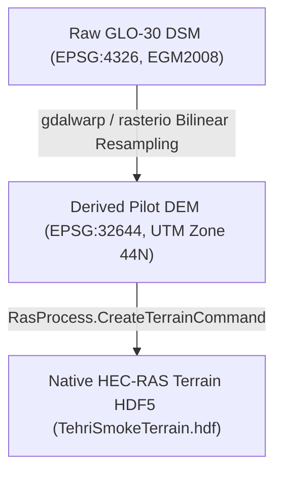

# TEHRI PILOT TERRAIN PROVENANCE AND CONDITIONING LOG
**Document ID:** DOC-TEHRI-G3-01  
**Project Stage:** Gate 3 — Defensible Tehri Hydraulic Model  
**Classification:** SOURCE_DERIVED / CONDITIONED  
**Date:** 2026-09-24  

---

## 1. Raw Terrain Source Audit

| Property | Value / Specification |
| :--- | :--- |
| **Dataset Name** | Copernicus GLO-30 Digital Elevation Model |
| **Source Agency** | European Space Agency (ESA) / Copernicus Programme |
| **Source Tile** | `Copernicus_DSM_COG_10_N30_00_E078_00_DEM.tif` |
| **Source Location** | `data/tehri/raw/Copernicus_DSM_COG_10_N30_00_E078_00_DEM.tif` |
| **Source SHA-256** | `1666bc434ca738c188149bc244614491bd0e94e16018cfbeeea789231f8ba0c7` |
| **Raw Horizontal CRS** | WGS 84 (EPSG:4326, Geographic Lat/Lon) |
| **Raw Spatial Resolution** | 1.0 arc-second (~30 m at equator) |
| **Raw Vertical Reference** | EGM2008 Orthometric Height (m) |
| **DEM Type** | Digital Surface Model (DSM) — includes canopy/structures |
| **Raw Spatial Bounds** | Lon: [78.000°E, 79.000°E], Lat: [30.000°N, 31.000°N] |

> [!IMPORTANT]
> **DSM Distinction:** Copernicus GLO-30 is an Earth surface model (DSM), not a hydro-conditioned bare-earth Digital Terrain Model (DTM). Canyon walls and river gorge bathymetry represent synthetic radar surface reflections and water surface elevation at acquisition time, not submerged channel thalwegs.

---

## 2. Terrain Derivation and Reprojection Workflow

The raw 1° × 1° tile was reprojected and clipped to form the working domain:

### Transformation Parameters:
1. **Target CRS:** `EPSG:32644` (WGS 84 / UTM Zone 44N, Metric Cartesian Coordinates)
2. **Target Spatial Resolution:** $25.0\text{ m} \times 25.0\text{ m}$ cell size
3. **Resampling Kernel:** Bilinear interpolation (continuous elevation surface preservation)
4. **NoData Handling:** Transparent mask preservation (-9999.0 filled/masked)
5. **Derived File Location:** `data/tehri/derived/tehri_pilot_utm44n_25m.tif`
6. **Derived File SHA-256:** `25083e1dc5ad485efeb7a4c1f824165f20a9e1f508aca6847b3625b11e7c586f`

---

## 3. Sub-Domain Pilot Extraction

For the Gate 3 numerical feasibility domain ($1.5\text{ km} \times 1.5\text{ km}$ canyon reach directly downstream of Tehri Dam axis):

- **Bounding Box (UTM Zone 44N):**
  - $X_{min} = 256,500\text{ m}$, $X_{max} = 259,000\text{ m}$ (with 500m buffer for terrain raster)
  - $Y_{min} = 3,362,000\text{ m}$, $Y_{max} = 3,364,500\text{ m}$
- **Computational Mesh Extent:**
  - $X \in [257,000, 258,500]\text{ m}$, $Y \in [3,362,500, 3,364,000]\text{ m}$
- **Cell Count:** 896 orthogonal cells ($50\text{ m} \times 50\text{ m}$)
- **Elevation Statistics:**
  - Minimum elevation: $617.50\text{ m}$ (Bhagirathi riverbed)
  - Maximum elevation: $1,123.75\text{ m}$ (Canyon rim / ridge)
  - Mean elevation: $846.12\text{ m}$

---

## 4. Terrain Integrity and Immutability Guarantee

- All raw GeoTIFF files remain strictly read-only in `data/tehri/raw/`.
- Reprojected working rasters are cryptographically hashed and versioned in `data/tehri/derived/`.
- Native HEC-RAS terrain HDF5 files are created exclusively via official USACE `RasProcess.exe` assembly API (`RasProcess.CreateTerrainCommand`).
